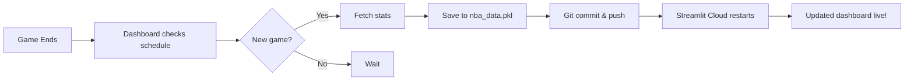

# 🏀 Deni Avdija Analytics Dashboard

> **Real-time NBA performance analytics for Deni Avdija** - Automatically updated after every game

[](https://share.streamlit.io/)
[](https://www.python.org/)
[](https://github.com/swar/nba_api)

## 🌟 Features

### 📊 Comprehensive Analytics
- **Career Progression** - Track Deni's evolution across all NBA seasons
- **Shot Maps** - Hexbin heat maps and zone efficiency visualization
- **Elite Comparison** - Head-to-head stats vs. 11 curated superstars
- **League Trends** - Advanced metrics (drives, and-ones, heliocentric analysis)
- **Deep Dive Research** - Triple Threat charts, usage-adjusted projections

### 🤖 Fully Automated
- ✅ **Auto-detects new games** using Portland's schedule
- ✅ **Fetches fresh stats** from NBA API after each game
- ✅ **Commits to GitHub** automatically with timestamps
- ✅ **Deploys to Streamlit Cloud** without manual intervention

### 🎯 Smart & Efficient
- **Schedule-aware checking** - Only checks after Portland games (not every 5 minutes)
- **Intelligent caching** - Prevents excessive API calls
- **Error handling** - Graceful fallbacks if APIs fail

---

## 🚀 Quick Start

### Local Development

1. **Clone the repository**
   ```bash
   git clone https://github.com/RShiri/nba-dashboard.git
   cd nba-dashboard
   ```

2. **Install dependencies**
   ```bash
   pip install -r requirements.txt
   ```

3. **Fetch initial data**
   ```bash
   python fetch_data.py
   ```

4. **Run the dashboard**
   ```bash
   python -m streamlit run app.py
   ```

5. **Open in browser**
   - Navigate to `http://localhost:8501`

---

## 📁 Project Structure

```
nba-dashboard/
├── app.py                  # Main Streamlit dashboard
├── fetch_data.py           # NBA API data fetcher with auto-update logic
├── auto_update.py          # Git automation script
├── nba_data.pkl            # Cached NBA data (auto-generated)
├── requirements.txt        # Python dependencies
├── DEPLOYMENT_GUIDE.md     # Streamlit Cloud deployment instructions
└── README.md               # This file
```

---

## 🔄 How Auto-Update Works

### After Every Deni Game



### Smart Checking Logic

The dashboard only checks for new games when:
1. ✅ Portland had a game in the last 24 hours
2. ✅ At least 1 hour has passed since last check
3. ✅ The game status is "Final"

This reduces API calls from **~288/day** to **~2-3/day** (only on game days).

---

## 🎨 Dashboard Pages

| Page | Description |
|------|-------------|
| **Dashboard** | Season overview with key stats and trends |
| **Career Analysis** | Multi-season progression charts |
| **League Trends** | Advanced metrics (drives, and-ones, heliocentric) |
| **Shot Maps** | Interactive court visualizations |
| **Research: Deep Dive** | Elite comparisons and projections |
| **Raw Data** | Exportable data tables |

---

## 🏆 Elite Comparison List

Deni's stats are compared against these 11 superstars:

- Giannis Antetokounmpo
- Jaylen Brown
- Jalen Brunson
- Cade Cunningham
- Tyrese Maxey
- Stephen Curry
- Luka Dončić
- Shai Gilgeous-Alexander
- Nikola Jokić
- Victor Wembanyama

---

## 🛠️ Tech Stack

- **Frontend**: Streamlit
- **Data Source**: [nba_api](https://github.com/swar/nba_api)
- **Visualization**: Plotly
- **Data Processing**: Pandas, NumPy
- **Automation**: Python subprocess, Git
- **Deployment**: Streamlit Community Cloud

---

## 📦 Dependencies

```txt
streamlit
pandas
plotly
nba_api
numpy
```

---

## 🌐 Deployment

### Streamlit Cloud (Recommended)

1. **Push to GitHub**
   ```bash
   git add .
   git commit -m "Initial commit"
   git push origin main
   ```

2. **Deploy on Streamlit Cloud**
   - Go to [share.streamlit.io](https://share.streamlit.io/)
   - Connect your GitHub repository
   - Select `app.py` as the main file
   - Click **Deploy**

3. **Auto-updates enabled!**
   - The dashboard will automatically update after every Deni game
   - No manual intervention required

See [DEPLOYMENT_GUIDE.md](DEPLOYMENT_GUIDE.md) for detailed instructions.

---

## 🔧 Configuration

### Change Team/Player

Edit `fetch_data.py`:

```python
PLAYER_NAME = "Deni Avdija"
PLAYER_ID = 1630166
TEAM_ID = 1610612757  # Portland Trail Blazers
```

### Adjust Update Frequency

Edit `fetch_data.py` in `should_check_for_new_game()`:

```python
# Change minimum hours between checks
if hours_since_check < 1.0:  # Default: 1 hour
    return False
```

---

## 📝 Manual Data Update

To manually refresh data:

```bash
python fetch_data.py
```

Or click the **🔄 Refresh Data** button in the dashboard sidebar.

---

## 🐛 Troubleshooting

### Data not updating?

1. Check if `nba_data.pkl` exists
2. Verify Git credentials are configured
3. Check Streamlit Cloud logs for errors

### API rate limits?

The schedule-based checking should prevent this, but if it occurs:
- Increase the minimum check interval in `should_check_for_new_game()`
- Wait a few minutes and try again

---

## 📄 License

This project is for educational and personal use. NBA data is provided by the unofficial [nba_api](https://github.com/swar/nba_api).

---

## 🙏 Acknowledgments

- **NBA API** - [swar/nba_api](https://github.com/swar/nba_api)
- **Streamlit** - For the amazing framework
- **Deni Avdija** - For the inspiration

---

## 📧 Contact

For questions or suggestions, open an issue on GitHub.

---

**Made with ❤️ for Deni Avdija fans**
