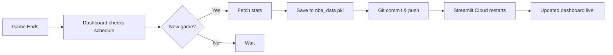

# 🏀 Deni Avdija Analytics Dashboard

> **Real-time NBA performance analytics for Deni Avdija** - Automatically updated after every game

### 🔗 Live demo: **https://nba-dashboard-ramshiri.streamlit.app/**

[](https://share.streamlit.io/)
[](https://www.python.org/)
[](https://github.com/swar/nba_api)

## 🌟 Features

### 📊 Comprehensive Analytics
- **At-a-glance KPI cards** - Season PPG / RPG / APG / MIN / FG% / 3P% / FT% / GP with season-over-season deltas
- **Career Progression** - Track Deni's evolution across all NBA seasons
- **Shot Maps** - Scatter shot charts and a white-outlined zone-efficiency map (every shot is attributed to a court section)
- **Elite Comparison** - Head-to-head stats vs. a curated All-Star cohort (frozen 24/25 benchmark **and** live current-season "race")
- **League Trends** - Advanced metrics (drives, fouls drawn, heliocentric analysis)
- **Deep Dive Research** - Triple Threat charts, usage-adjusted projections

### 🎨 Design
- **Dark theme** matching the [WC2026 dashboard](https://rshiri.github.io/XWORLDCUPTWIT/wc2026_dashboard/) — navy `#0b0f1a`, green accent `#3ddc97`
- Configured in [`.streamlit/config.toml`](.streamlit/config.toml) + a custom CSS layer + a unified dark Plotly template
- Hero banner, sticky top brand bar, gradient stat cards (green values), pill tabs, styled sidebar player card
- **"View source on GitHub" links** in the sidebar footer and the About Me page

### 🗓️ Season-Proof (auto-rolls each year)
- The current NBA season is **computed from the date**, not hardcoded — it auto-advances to `2026-27` the moment October 2026 arrives, then `2027-28`, and so on
- Game logs, shot charts, the All-Star "race", league leaderboards, and all on-screen labels follow automatically — **no code edits needed** at season turnover
- The `2024-25` All-Star **benchmark** stays frozen on purpose as a fixed reference point

### 🤖 Fully Automated
- ✅ **Auto-detects new games** using Portland's schedule
- ✅ **Fetches fresh stats** from NBA API after each game
- ✅ **Commits to GitHub** automatically with timestamps
- ✅ **Deploys to Streamlit Cloud** without manual intervention

### 🎯 Smart & Efficient
- **Schedule-aware checking** - Only checks after Portland games (not every 5 minutes)
- **Intelligent caching** - Prevents excessive API calls
- **Error handling** - Graceful fallbacks if APIs fail
- **Offline/CI mode** - Set `SKIP_AUTO_UPDATE=1` to skip the on-load network check (used for local previews and tests)

---

## 🚀 Quick Start

### Local Development

1. **Clone the repository**
   ```bash
   git clone https://github.com/RShiri/nba-dashboard.git
   cd nba-dashboard
   ```

2. **Install dependencies**
   ```bash
   pip install -r requirements.txt
   ```

3. **Fetch initial data**
   ```bash
   python fetch_data.py
   ```

4. **Run the dashboard**
   ```bash
   python -m streamlit run app.py
   ```
   > On Windows, if `python` opens the Microsoft Store, use the launcher instead: `py -m streamlit run app.py`.
   > To preview offline without the on-load NBA API check: `SKIP_AUTO_UPDATE=1 py -m streamlit run app.py` (PowerShell: `$env:SKIP_AUTO_UPDATE=1; py -m streamlit run app.py`).

5. **Open in browser**
   - Navigate to `http://localhost:8501`

---

## 📁 Project Structure

```
nba-dashboard/
├── app.py                     # Main Streamlit dashboard (theme + dynamic seasons)
├── fetch_data.py              # NBA API data fetcher + auto-update & season logic
├── auto_update.py             # Git automation script
├── nba_data.pkl               # Cached NBA data (auto-generated)
├── requirements.txt           # Python dependencies
├── .streamlit/config.toml     # Dark theme (WC2026 palette)
├── profile_pic.png            # About Me photo
├── DEPLOYMENT_GUIDE.md        # Streamlit Cloud deployment instructions
└── README.md                  # This file
```

---

## 🔄 How Auto-Update Works

### After Every Deni Game


```mermaid
graph LR
    A[Game Ends] --> B[Dashboard checks schedule]
    B --> C{New game?}
    C -->|Yes| D[Fetch stats]
    C -->|No| E[Wait]
    D --> F[Save to nba_data.pkl]
    F --> G[Git commit & push]
    G --> H[Streamlit Cloud restarts]
    H --> I[Updated dashboard live!]
```

### Smart Checking Logic

The dashboard only checks for new games when:
1. ✅ Portland had a game in the last 24 hours
2. ✅ At least 1 hour has passed since last check
3. ✅ The game status is "Final"

This reduces API calls from **~288/day** to **~2-3/day** (only on game days).

### Dynamic Season Detection

The "current season" is derived from today's date by `fetch_data.get_current_season()`:

| Months | Season resolved |
|--------|-----------------|
| October → December | `YEAR-(YEAR+1)` (e.g. Oct 2026 → `2026-27`) |
| January → September | `(YEAR-1)-YEAR` (e.g. Mar 2027 → `2026-27`) |

Because the season string, pickle keys (`game_logs_2026_27`, …), the season tip-off date, and every UI label are all derived from this helper, **the app rolls into 2026-27 (and beyond) with zero code changes** — the scraper simply starts fetching the new season once games are played. The previous two seasons are kept for the Dashboard's three "Impact" panels; the `2024-25` All-Star benchmark is frozen.

---

## 🎨 Dashboard Pages

| Page | Description |
|------|-------------|
| **Dashboard** | Hero header, KPI cards (with season deltas), and per-game impact charts for the last three seasons |
| **Career Analysis** | Multi-season progression: per-game, per-36, usage rate, true shooting |
| **League Trends** | Advanced metrics (heliocentric offense, sniper finders, foul magnets, rim pressure) |
| **Shot Maps** | Shot charts + white-outlined zone efficiency (all shots attributed), single or side-by-side compare |
| **Research: Deep Dive** | Frozen 24/25 benchmark **and** live current-season All-Star race, plus projections |
| **Raw Data** | Custom trend viewer and exportable career table |
| **About Me** | Creator profile |

---

## 🏆 Elite Comparison Cohort

Deni's stats are compared against a curated cohort of All-Stars & risers, defined by `ALL_STAR_NAMES` in [`fetch_data.py`](fetch_data.py). Current members:

Giannis Antetokounmpo · Jaylen Brown · Jalen Brunson · Cade Cunningham · Tyrese Maxey · Stephen Curry · Luka Dončić · Shai Gilgeous-Alexander · Nikola Jokić · Victor Wembanyama · Anthony Edwards · Jamal Murray · Chet Holmgren · Kevin Durant · Devin Booker · LeBron James · Scottie Barnes · Jalen Johnson · Norman Powell · Karl-Anthony Towns · Pascal Siakam · Donovan Mitchell · Jalen Duren

> Edit that list to change who Deni is benchmarked against. The **benchmark tab** freezes this cohort's 2024-25 numbers; the **race tab** shows the same cohort's current-season numbers.

---

## 🛠️ Tech Stack

- **Frontend**: Streamlit
- **Data Source**: [nba_api](https://github.com/swar/nba_api)
- **Visualization**: Plotly
- **Data Processing**: Pandas, NumPy
- **Automation**: Python subprocess, Git
- **Deployment**: Streamlit Community Cloud

---

## 📦 Dependencies

```txt
streamlit
pandas
plotly
numpy
matplotlib
nba_api
requests
```

---

## 🌐 Deployment

### Streamlit Cloud (Recommended)

1. **Push to GitHub**
   ```bash
   git add .
   git commit -m "Initial commit"
   git push origin main
   ```

2. **Deploy on Streamlit Cloud**
   - Go to [share.streamlit.io](https://share.streamlit.io/)
   - Connect your GitHub repository
   - Select `app.py` as the main file
   - Click **Deploy**

3. **Auto-updates enabled!**
   - The dashboard will automatically update after every Deni game
   - No manual intervention required

See [DEPLOYMENT_GUIDE.md](DEPLOYMENT_GUIDE.md) for detailed instructions.

---

## 🔧 Configuration

### Change Team/Player

Edit `fetch_data.py`:

```python
PLAYER_NAME = "Deni Avdija"
PLAYER_ID = 1630166
TEAM_ID = 1610612757  # Portland Trail Blazers
```

### Adjust Update Frequency

Edit `fetch_data.py` in `should_check_for_new_game()`:

```python
# Change minimum hours between checks
if hours_since_check < 1.0:  # Default: 1 hour
    return False
```

### Seasons (automatic)

You **don't** need to bump season strings each year — they are computed dynamically:

```python
CURRENT_SEASON = get_current_season()      # e.g. "2025-26", then "2026-27" after Oct 2026
PREV_SEASON    = add_season(CURRENT_SEASON, -1)
BENCHMARK_SEASON = "2024-25"               # frozen All-Star benchmark (change only if you want a new baseline)
```

### Offline / CI Mode

```bash
SKIP_AUTO_UPDATE=1 py -m streamlit run app.py   # skips the on-load NBA API check
```

---

## 📝 Manual Data Update

To manually refresh data:

```bash
python fetch_data.py
```

Or click the **🔄 Refresh Data** button in the dashboard sidebar.

---

## 🐛 Troubleshooting

### Data not updating?

1. Check if `nba_data.pkl` exists
2. Verify Git credentials are configured
3. Check Streamlit Cloud logs for errors

### API rate limits?

The schedule-based checking should prevent this, but if it occurs:
- Increase the minimum check interval in `should_check_for_new_game()`
- Wait a few minutes and try again

---

## 📄 License

This project is for educational and personal use. NBA data is provided by the unofficial [nba_api](https://github.com/swar/nba_api).

---

## 🙏 Acknowledgments

- **NBA API** - [swar/nba_api](https://github.com/swar/nba_api)
- **Streamlit** - For the amazing framework
- **Deni Avdija** - For the inspiration

---

## 📧 Contact

For questions or suggestions, open an issue on GitHub.

---

**Made with ❤️ for Deni Avdija fans**
