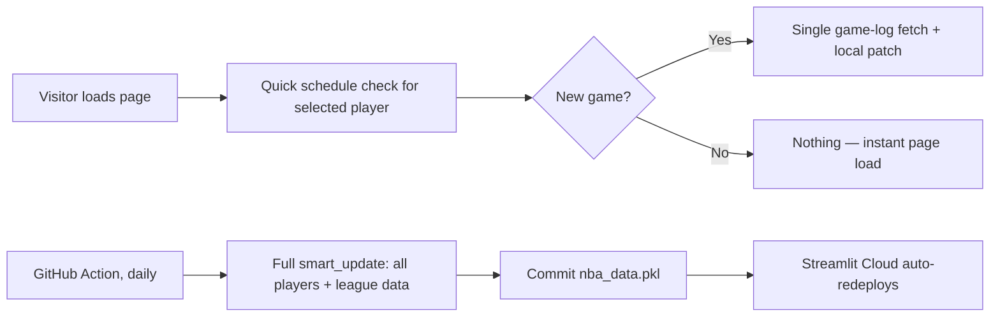

# 🏀 Israeli NBA Players Analytics Dashboard

> **Real-time NBA performance analytics for every active Israeli NBA player** — Deni Avdija, Ben Saraf, Danny Wolf, and Emanuel Sharp — automatically updated after every game.

This project ships as **two parallel front ends** sharing the same `nba_data.pkl`:

| | URL | Stack | Notes |
|---|---|---|---|
| **Static site** | **https://rshiri.github.io/nba-dashboard/** | Plain HTML/CSS/JS + Plotly.js, served by GitHub Pages | No server, no cold start — just files. Reads pre-built JSON under `nba_dashboard/data/`. |
| **Streamlit app** | **https://nba-dashboard-ramshiri.streamlit.app/** | Python + Streamlit | Adds the live "quick refresh" on-page-load check and manual refresh buttons. |

If the Streamlit app feels slow to spin up (Streamlit Community Cloud sleeps idle apps), the GitHub Pages link is the faster option — it's genuinely static, so there's nothing to wake up.

[](https://share.streamlit.io/)
[](https://www.python.org/)
[](https://github.com/swar/nba_api)

## 🌟 Features

### 👥 Every Active Israeli NBA Player
A sidebar player switcher re-renders every page for whichever player is selected:
- **Deni Avdija** — Portland Trail Blazers, 2026 NBA All-Star
- **Ben Saraf** — Brooklyn Nets
- **Danny Wolf** — Brooklyn Nets
- **Emanuel Sharp** — Sacramento Kings

### 📊 Comprehensive Analytics
- **At-a-glance KPI cards** - Season PPG / RPG / APG / MIN / FG% / 3P% / FT% / GP with season-over-season deltas
- **Career Progression** - Track each player's evolution across all NBA seasons
- **Shot Maps** - Scatter shot charts and a white-outlined zone-efficiency map (every shot is attributed to a court section)
- **Elite Comparison** - Head-to-head stats vs. a curated All-Star cohort (frozen 24/25 benchmark **and** live current-season "race")
- **League Trends** - Advanced metrics (drives, fouls drawn, heliocentric analysis) shared across the whole league
- **Deep Dive Research** - Triple Threat charts, usage-adjusted projections

### 🎨 Design
- **"Broadcast Kinetic" dark theme**, ported from the [XLALIGA dashboard](https://rshiri.github.io/XLALIGA/) — carbon ground `#0c0d10`, ONE signal colour (lime `#d7ff3a`), red as the only other semantic colour, condensed/uppercase Barlow Condensed display type, no border radius anywhere
- Configured in [`.streamlit/config.toml`](.streamlit/config.toml) + a custom CSS layer + a unified dark Plotly template
- Hero banner, sticky top brand bar, plate-style KPI cards, sharp-edged tabs, styled sidebar player card with a switcher
- **"View source on GitHub" links** in the sidebar footer and the About Me page

### 🗓️ Season-Proof (auto-rolls each year)
- The current NBA season is **computed from the date**, not hardcoded — it auto-advances to `2026-27` the moment October 2026 arrives, then `2027-28`, and so on
- Game logs, shot charts, the All-Star "race", league leaderboards, and all on-screen labels follow automatically — **no code edits needed** at season turnover
- Each player's data only spans seasons on/after their own draft season — a 2025 draftee never wastes an API call on a season before they existed
- The `2024-25` All-Star **benchmark** stays frozen on purpose as a fixed reference point

### 🤖 Automated, Without Blocking Visitors
- ✅ **Lightweight on-load check** for whichever player is selected: a couple of fast schedule lookups, and — only when a genuinely new completed game is confirmed — a single game-log API call. This never blocks a page load for minutes.
- ✅ **Comprehensive scheduled refresh** via GitHub Actions (`.github/workflows/update_data.yml`): fetches career stats, game logs, and shot charts for every player, plus the shared All-Star cohort and League Trends data, and commits the result.
- ✅ **Manual refresh buttons** in the sidebar: refresh just the selected player (fast) or every player + shared league data (slower, explicit).
- ✅ **Error handling** - Graceful fallbacks if APIs fail
- ✅ **Offline/CI mode** - Set `SKIP_AUTO_UPDATE=1` to skip the on-load network check (used for local previews and tests)

---

## 🚀 Quick Start

### Local Development

1. **Clone the repository**
   ```bash
   git clone https://github.com/RShiri/nba-dashboard.git
   cd nba-dashboard
   ```

2. **Install dependencies**
   ```bash
   pip install -r requirements.txt
   ```

3. **Fetch initial data** (every player + shared league data)
   ```bash
   python fetch_data.py
   ```
   Or just one player while iterating: `python fetch_data.py --player ben_saraf`

4. **Run the dashboard**
   ```bash
   python -m streamlit run app.py
   ```
   > On Windows, if `python` opens the Microsoft Store, use the launcher instead: `py -m streamlit run app.py`.
   > To preview offline without the on-load NBA API check: `SKIP_AUTO_UPDATE=1 py -m streamlit run app.py` (PowerShell: `$env:SKIP_AUTO_UPDATE=1; py -m streamlit run app.py`).

5. **Open in browser**
   - Navigate to `http://localhost:8501`

---

## 📁 Project Structure

```
nba-dashboard/
├── app.py                     # Main Streamlit dashboard (player switcher + theme + dynamic seasons)
├── fetch_data.py              # NBA API data fetcher (multi-player) + auto-update & season logic
├── build_data.py              # Exports nba_data.pkl -> nba_dashboard/data/*.json for the static site
├── auto_update.py             # Git automation script (also rebuilds + commits the static site data)
├── nba_data.pkl               # Cached NBA data (auto-generated) — keyed by player under "players"
├── index.html                 # Root redirect -> nba_dashboard/index.html (for GitHub Pages)
├── nba_dashboard/              # Static site (GitHub Pages) — plain HTML/CSS/JS, no server
│   ├── index.html              # Page shell (sidebar, topbar, #page-content mount point)
│   ├── styles.css               # Broadcast Kinetic theme, ported 1:1 from the Streamlit CSS
│   ├── app.js                    # Router + every page's rendering logic (vanilla JS + Plotly.js)
│   ├── vendor/plotly.min.js       # Vendored Plotly.js (no runtime CDN dependency)
│   └── data/                      # Generated JSON (meta, shared, zones, one file per player)
├── requirements.txt           # Python dependencies
├── .streamlit/config.toml     # Dark theme (Broadcast Kinetic palette)
├── .github/workflows/         # Scheduled full data refresh (all players + shared league data + static JSON)
├── profile_pic.png            # About Me photo
├── DEPLOYMENT_GUIDE.md        # Streamlit Cloud deployment instructions
└── README.md                  # This file
```

---

## 🔄 How Auto-Update Works

### Two layers, so nobody waits on a live scrape

1. **On page load** (`app.py`'s `check_and_update_data()`): a couple of fast schedule
   lookups for the *selected* player's team only. If — and only if — a genuinely new
   completed game is confirmed, it makes a **single** game-log API call
   (`fetch_data.quick_refresh_player()`) to patch that player's current-season stats.
   Never blocks on the full multi-player pipeline.
2. **Scheduled / manual full refresh** (`fetch_data.smart_update()`, run by the
   GitHub Action or the sidebar's "Refresh ALL players" button): fetches career stats,
   game logs, and shot charts for every player, plus the shared All-Star cohort and
   League Trends data, and commits the result.


```mermaid
graph LR
    A[Visitor loads page] --> B[Quick schedule check for selected player]
    B --> C{New game?}
    C -->|Yes| D[Single game-log fetch + local patch]
    C -->|No| E[Nothing — instant page load]
    F[GitHub Action, daily] --> G[Full smart_update: all players + league data]
    G --> H[Commit nba_data.pkl]
    H --> I[Streamlit Cloud auto-redeploys]
```

### Smart Checking Logic

The dashboard only checks for new games when:
1. ✅ The selected player's team had a game in the last 24 hours
2. ✅ At least 1 hour has passed since the last check (per player, per browser session)
3. ✅ The game status is "Final"

### Dynamic Season Detection

The "current season" is derived from today's date by `fetch_data.get_current_season()`:

| Months | Season resolved |
|--------|-----------------|
| October → December | `YEAR-(YEAR+1)` (e.g. Oct 2026 → `2026-27`) |
| January → September | `(YEAR-1)-YEAR` (e.g. Mar 2027 → `2026-27`) |

Because the season string, pickle keys (`game_logs_2026_27`, …), the season tip-off date, and every UI label are all derived from this helper, **the app rolls into 2026-27 (and beyond) with zero code changes** — the scraper simply starts fetching the new season once games are played. The previous two seasons are kept for the Dashboard's three "Impact" panels; the `2024-25` All-Star benchmark is frozen.

---

## 🎨 Dashboard Pages

| Page | Description |
|------|-------------|
| **Dashboard** | Hero header, KPI cards (with season deltas), and per-game impact charts for the last three seasons |
| **Career Analysis** | Multi-season progression: per-game, per-36, usage rate, true shooting |
| **League Trends** | Advanced metrics (heliocentric offense, sniper finders, foul magnets, rim pressure) — shared across the whole league, not player-specific |
| **Shot Maps** | Shot charts + white-outlined zone efficiency (all shots attributed), single or side-by-side compare |
| **Research: Deep Dive** | Frozen 24/25 benchmark **and** live current-season All-Star race, plus projections |
| **Raw Data** | Custom trend viewer and exportable career table |
| **About Me** | Creator profile |

---

## 🏆 Elite Comparison Cohort

Every player's stats are compared against a curated cohort of All-Stars & risers, defined
by `ALL_STAR_NAMES` in [`fetch_data.py`](fetch_data.py) — the 2026 NBA All-Star Game
roster (Deni Avdija made the team as a Western reserve, so he's excluded from his own
comparison cohort at render time):

Giannis Antetokounmpo · Jaylen Brown · Jalen Brunson · Cade Cunningham · Tyrese Maxey · Stephen Curry · Luka Dončić · Shai Gilgeous-Alexander · Nikola Jokić · Victor Wembanyama · Anthony Edwards · Jamal Murray · Chet Holmgren · Kevin Durant · Devin Booker · LeBron James · Scottie Barnes · Jalen Johnson · Norman Powell · Karl-Anthony Towns · Pascal Siakam · Donovan Mitchell · Jalen Duren · Deni Avdija

> Edit that list (and update it every February after All-Star rosters are announced) to change the comparison cohort. The **benchmark tab** freezes this cohort's 2024-25 numbers; the **race tab** shows the same cohort's current-season numbers.

---

## 🛠️ Tech Stack

- **Frontend**: Streamlit
- **Data Source**: [nba_api](https://github.com/swar/nba_api)
- **Visualization**: Plotly
- **Data Processing**: Pandas, NumPy
- **Automation**: GitHub Actions (scheduled), Python subprocess + Git (auto-commit)
- **Deployment**: Streamlit Community Cloud

---

## 📦 Dependencies

```txt
streamlit
pandas
plotly
numpy
matplotlib
nba_api
requests
```

---

## 🌐 Deployment

### Streamlit Cloud (Recommended)

1. **Push to GitHub**
   ```bash
   git add .
   git commit -m "Update"
   git push origin master
   ```

2. **Deploy on Streamlit Cloud**
   - Go to [share.streamlit.io](https://share.streamlit.io/)
   - Connect your GitHub repository
   - Select `app.py` as the main file
   - Click **Deploy**

3. **Auto-updates enabled!**
   - The GitHub Action refreshes every player daily; the live app also does a quick
     per-visitor check for the selected player
   - No manual intervention required

See [DEPLOYMENT_GUIDE.md](DEPLOYMENT_GUIDE.md) for detailed instructions.

---

## 🔧 Configuration

### Players tracked

Edit the `PLAYERS` registry in `fetch_data.py`:

```python
PLAYERS = {
    "deni_avdija": {"name": "Deni Avdija", "id": 1630166, "team_id": 1610612757, ...},
    "ben_saraf": {"name": "Ben Saraf", "id": 1642879, "team_id": 1610612751, ...},
    ...
}
```

Add a new entry (NBA.com player ID, team ID, draft season) and it shows up in the
sidebar switcher automatically — `app.py` reads the same registry.

### Adjust Update Frequency

Edit `fetch_data.py` in `should_check_for_new_game()`:

```python
# Change minimum hours between checks
if hours_since_check < 1.0:  # Default: 1 hour
    return False
```

### Seasons (automatic)

You **don't** need to bump season strings each year — they are computed dynamically:

```python
CURRENT_SEASON = get_current_season()      # e.g. "2025-26", then "2026-27" after Oct 2026
PREV_SEASON    = add_season(CURRENT_SEASON, -1)
BENCHMARK_SEASON = "2024-25"               # frozen All-Star benchmark (change only if you want a new baseline)
```

### Offline / CI Mode

```bash
SKIP_AUTO_UPDATE=1 py -m streamlit run app.py   # skips the on-load NBA API check
```

---

## 📝 Manual Data Update

To manually refresh every player + shared league data:

```bash
python fetch_data.py
```

Or just one player: `python fetch_data.py --player danny_wolf`

Or click **🔄 Refresh &lt;Player&gt;** (fast, one player) or **Refresh ALL players + league data**
(slower, under "Advanced ▾") in the dashboard sidebar.

`fetch_data.py` only updates `nba_data.pkl`. To also refresh the **static site's** JSON:

```bash
python build_data.py
```

The sidebar buttons and the GitHub Action already do this automatically — you only need
to run it by hand if you ran `fetch_data.py` directly and want the static site (not just
the Streamlit app) to reflect the new data right away.

---

## 🐛 Troubleshooting

### Data not updating?

1. Check if `nba_data.pkl` exists and has a `"players"` key with the player you expect
2. Check the GitHub Actions run logs under the **Actions** tab for the failing step's output
3. Verify Git credentials are configured (for local `auto_update.py` pushes)
4. Check Streamlit Cloud logs for errors

### API rate limits?

The schedule-based checking should prevent this, but if it occurs:
- Increase the minimum check interval in `should_check_for_new_game()`
- Wait a few minutes and try again

### A newly-drafted player shows no data

A player's game logs / shot charts stay empty until they've actually played an NBA
game — the dashboard handles this gracefully (an info message instead of an error)
rather than assuming every player already has a career.

---

## 📄 License

This project is for educational and personal use. NBA data is provided by the unofficial [nba_api](https://github.com/swar/nba_api).

---

## 🙏 Acknowledgments

- **NBA API** - [swar/nba_api](https://github.com/swar/nba_api)
- **Streamlit** - For the amazing framework
- **Deni Avdija, Ben Saraf, Danny Wolf, Emanuel Sharp** - For the inspiration

---

## 📧 Contact

For questions or suggestions, open an issue on GitHub.

---

**Made with ❤️ for Israeli NBA fans**
